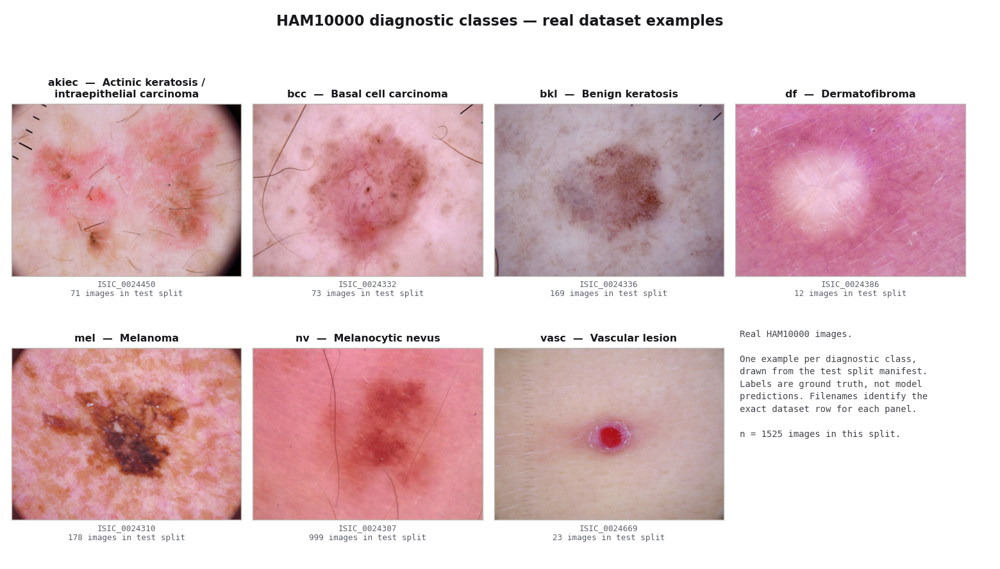
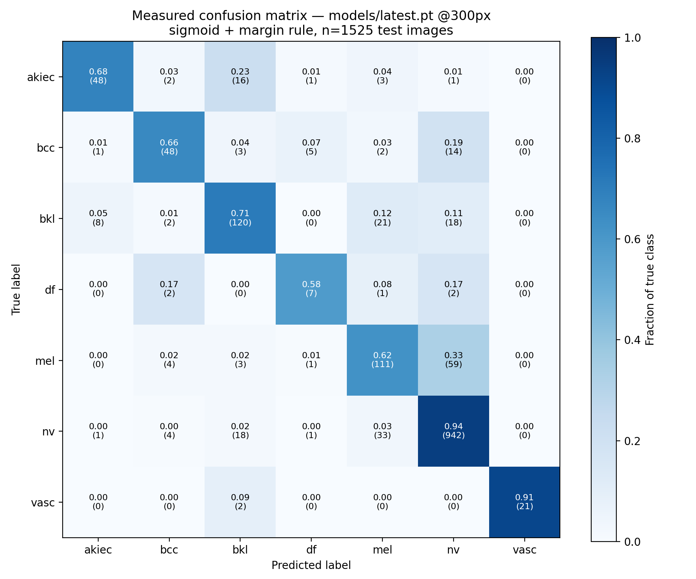

# Skin Cancer Classification Model Details

This document provides technical specifications and performance metrics for the skin cancer diagnostic model utilized in this project.

## Clinical Context: ABCDE Rules

Before specialized neural analysis, clinicians often use the **ABCDE criteria** for the visual assessment of pigmented lesions, particularly for identifying potential melanoma.

| Rule | Aspect | Description |
| :--- | :--- | :--- |
| **A** | Asymmetry | One half of the mole does not match the other. |
| **B** | Border | Edges are irregular, ragged, notched, or blurred. |
| **C** | Color | Pigmentation is not uniform across the lesion. |
| **D** | Diameter | Usually greater than 6mm (approx. size of a pencil eraser). |
| **E** | Evolving | The mole is changing in size, shape, or color. |

## Model Architecture

- **Base Model:** EfficientNet-B3 (via `timm` library)
- **Input Resolution:** 300x300 pixels
- **State:** Evaluation Mode (`eval()`) with pre-trained weights loaded from `models/latest.pt`.

## Data Processing & Preprocessing

The model uses a standardized ImageNet-based preprocessing pipeline:
1. **Resize:** Input images are resized directly to 300x300 (no centre crop),
   matching `img_size: 300` and `get_val_transforms` in the training repository.
2. **Normalization:**
   - Mean: `[0.485, 0.456, 0.406]`
   - Std Dev: `[0.229, 0.224, 0.225]`

## Classification Categories

The model is trained on the HAM10000 dataset to recognize the following 7 morphologies.


*One real image per class from the HAM10000 test split, each labelled with its
ISIC id and ground-truth diagnosis so any panel can be traced to its dataset row.
Regenerate with `python scripts/build_class_samples.py`.*

| Label | Full Name | Description |
| :--- | :--- | :--- |
| **akiec** | Actinic Keratosis | Also includes Bowen's disease / intraepithelial carcinoma. |
| **bcc** | Basal Cell Carcinoma | A common form of skin cancer. |
| **bkl** | Benign Keratosis | Includes seborrheic keratoses and lichen-planus like keratoses. |
| **df** | Dermatofibroma | A benign fibrous skin lesion. |
| **mel** | Melanoma | The most serious type of skin cancer. |
| **nv** | Melanocytic Nevi | Common moles (benign). |
| **vasc** | Vascular Lesions | Includes angiomas, hemorrhage, and pyogenic granulomas. |

## Performance Metrics

Metrics are based on optimized classification thresholds to maximize the Macro F1-Score.

### Threshold-optimization run (calibration split, n=997)
- **Baseline F1 (Macro):** 0.7272
- **Optimized F1 (Macro):** 0.7288

These are calibration-set figures recorded in `models/class_thresholds.json` when
the thresholds were fitted. They are **not** test-set performance; see below.

### Measured Test-Set Performance

Measured by running the served checkpoint over the full held-out HAM10000 test
split (1525 images) — not reconstructed from summary statistics.

- **Served model:** `models/latest.pt` (plain timm EfficientNet-B3, `MODEL_ARCH=plain`)
- **Preprocessing:** `Resize(300, 300)`, no centre crop — matches `img_size: 300`
  in the training config
- **Readout:** sigmoid, decision rule `argmax(probability - class threshold)`
- **Accuracy:** 0.8505  **Macro-F1:** 0.7450

| Class | Support | Precision | Recall | F1 |
| :--- | ---: | ---: | ---: | ---: |
| **akiec** | 71 | 0.8276 | 0.6761 | 0.7442 |
| **bcc** | 73 | 0.7742 | 0.6575 | 0.7111 |
| **bkl** | 169 | 0.7407 | 0.7101 | 0.7251 |
| **df** | 12 | 0.4667 | 0.5833 | 0.5185 |
| **mel** | 178 | 0.6491 | 0.6236 | 0.6361 |
| **nv** | 999 | 0.9093 | 0.9429 | 0.9258 |
| **vasc** | 23 | 1.0000 | 0.9130 | 0.9545 |


*Measured confusion matrix, n=1525. Counts in parentheses, row-normalised shading.*

Raw numbers: `docs/evaluation_results.json`. Reproduce with:

```bash
python scripts/evaluate_model.py --data-dir path/to/test_set
```

#### Melanoma performance is the limiting factor

Melanoma recall is **0.624** — around 38% of melanomas in the test set are
missed. The confusion matrix shows most of that error going to `nv` (benign
nevus). This is the dominant clinical risk in the system and no amount of
interface polish changes it.

This configuration was chosen over higher-accuracy alternatives for that reason.
Measured options on the same test set:

| Config | Accuracy | Macro-F1 | Melanoma recall | Melanoma F1 |
| :--- | ---: | ---: | ---: | ---: |
| 300px softmax + margin | 0.8616 | 0.7668 | 0.5393 | 0.6316 |
| **300px sigmoid + margin (shipped)** | **0.8505** | **0.7450** | **0.6236** | **0.6361** |
| 224px + crop, sigmoid + margin (previous) | 0.8066 | 0.7116 | 0.6798 | 0.5641 |

#### Threshold operating point

The thresholds in `models/class_thresholds.json` were originally optimized on
*softmax* probabilities with a different decision rule
(`skin_cancer/scripts/optimize_thresholds.py`). They were re-fitted for the
served pairing (sigmoid + margin rule) on the calibration split (n=997) and
reported on the test split (n=1525):

| Thresholds | Accuracy | Macro-F1 | Melanoma recall | Melanoma F1 |
| :--- | ---: | ---: | ---: | ---: |
| **Current (shipped)** | 0.8505 | 0.7450 | 0.6236 | **0.6361** |
| Refit for macro-F1 | **0.8557** | **0.7551** | 0.5000 | 0.6075 |
| Refit for melanoma recall | 0.8308 | 0.7367 | **0.6798** | 0.6111 |

**No configuration dominates the current one.** The refit did not find free
headroom; melanoma recall trades against accuracy monotonically. The shipped
thresholds already sit on the efficient frontier and hold the best melanoma F1,
so they were left unchanged.

Sweeping the melanoma threshold alone (all others at the macro-F1 fit) maps the
tradeoff, selected on calibration and reported on test:

| `mel` threshold | Accuracy | Melanoma recall | Melanoma F1 |
| ---: | ---: | ---: | ---: |
| 0.20 | 0.8256 | 0.7416 | 0.5986 |
| 0.25 | 0.8348 | 0.7135 | 0.6135 |
| 0.30 | 0.8393 | 0.6798 | 0.6189 |
| 0.35 | 0.8446 | 0.6404 | 0.6230 |
| 0.40 | 0.8531 | 0.6180 | 0.6377 |
| 0.45 | 0.8584 | 0.5843 | 0.6480 |
| 0.50 | 0.8557 | 0.5000 | 0.6075 |

Lowering the melanoma threshold buys recall at roughly **1 point of accuracy per
3-4 points of melanoma recall**. Choosing a different operating point is a change
to the `mel` entry in `models/class_thresholds.json` — a clinical decision about
the relative cost of a missed melanoma versus a false alarm, not a tuning detail.

Re-fit with:

```bash
python scripts/optimize_thresholds.py     --calib-dir path/to/calib_set --test-dir path/to/test_set     --readout sigmoid --objective mel_recall
```

It fits on the calibration split, reports on the test split, writes only with
`--write`, and refuses to write thresholds that cost more than 2 points of test
macro-F1.

#### On training curves

Per-epoch loss/F1/accuracy curves are **not available**. The checkpoints store
only a single epoch's metrics, and the training run kept no history log. They
cannot be reconstructed after the fact, and figures previously shown here were
generated from hardcoded exponentials rather than measured — they have been
removed.

#### A note on checkpoints

`skin_cancer/checkpoints/best.pt` uses a different architecture (two-layer head,
`MODEL_ARCH=multihead`) and is an **earlier, weaker** run: measured accuracy
0.6570 / macro-F1 0.4464 on the same test set. It is not the served model. The
architecture is selected explicitly by `MODEL_ARCH` and loaded strictly, so
swapping checkpoints fails loudly rather than silently changing the network.

## Confidence calibration and the melanoma alert channel

Two distinct problems: the model **misses melanomas** (recall 0.624) and it does so
**confidently** (mean stated confidence on wrong answers 0.942). They have
different fixes, and neither requires retraining.

### Why the alert channel works

On the melanomas the model misses, it still assigns a substantial melanoma
probability — median p(mel) = 0.539 across the 67 missed cases. The recall ceiling is
imposed by the **argmax**, not by what the model knows: `nv` simply edges ahead.
Flagging on p(mel) directly, independently of which class wins, recovers most of them.

### Fitted values

Temperature is chosen on the calibration split (n=997) by minimising expected
calibration error; the alert threshold is the lowest review rate reaching 90% melanoma
sensitivity there. Both are reported on the held-out test split (n=1525).

| Measure | Before | After |
| :--- | ---: | ---: |
| Accuracy | 0.8505 | **0.8544** |
| Expected calibration error | 0.1162 | **0.0511** |
| Mean confidence when wrong | 0.9418 | **0.8141** |
| Melanoma recall (argmax) | 0.6236 | 0.6236 |
| **Melanoma surfaced (argmax or alert)** | 0.8764 | **0.8989** |
| Cases flagged for review | 0.2420 | 0.3051 |

`temperature = 2.0`, `mel_alert_threshold = 0.45` in `models/calibration.json`.

Temperature scaling is not a trade here: accuracy rises slightly and melanoma recall is
unchanged, because dividing the logits leaves most of the ordering intact. What changes
is that stated confidence stops being uniformly ~0.97.

The alert channel is a genuine trade: **90% of melanomas surfaced against a
31% review rate**. It does not alter the primary prediction — it is an
additional output, shown in the UI as "melanoma not excluded".

Re-fit with:

```bash
python scripts/fit_calibration.py --calib-dir <calib> --test-dir <test> --write
```

`--target-sensitivity` moves the operating point; higher sensitivity means more cases
flagged. With no calibration file present, confidences are raw and the alert is off.

### What this does not do

Neither fix improves what the model actually knows. Melanoma recall by argmax is
unchanged at 0.624, and the alert channel raises the review burden rather than the
model's discrimination. A real improvement needs retraining — melanoma-weighted loss,
more melanoma data, or a dedicated melanoma-versus-nevus head.

## Out-of-Distribution (OOD) Gatekeeper

Three stages guard inference.

### Stage 1: Illumination-invariant image statistics

Every metric is a **ratio**, so scaling an image's brightness leaves it unchanged.

| Metric | Rule | Rejects |
| :--- | :--- | :--- |
| `rel_contrast` (luminance std / mean) | `< 0.04` | Flat colour fields |
| `hf_ratio` (high-frequency residual / total) | `> 0.45` | Pixel noise |
| `blue_green` (over chromatic pixels only) | `> 0.60` | Sky, foliage, surgical drape |

Hue checks apply only when at least 25% of pixels carry a numerically meaningful
hue. Grayscale images fall below that and **skip** the hue checks rather than
being rejected.

#### Why this replaced the previous rules

The previous gate used absolute channel standard deviation (`avg_std`), which
scales with brightness. Identical lesions rejected or accepted purely on how dark
the image was — a direct bias against darker skin tones and underexposed
captures. Measured on the repository's own sample images, `ISIC_0024307`
darkened to 35% brightness was rejected as `too_uniform` while the identical
lighter image passed. `rel_contrast` is constant across the same range
(0.119 → 0.120).

Two further rules were removed: `grayscale_not_allowed`, which excluded
legitimate grayscale dermoscopy, and `avg_std > 65`, which rejected
high-contrast dermoscopic images — a dark lesion on pale skin, i.e. the
presentation of most concern.

On a 21-case check of skin images (including darkened, grayscale and
contrast-boosted variants) plus non-skin controls, the old gate produced 6
incorrect verdicts and the new gate 1.

### Stage 2: Feature-space Mahalanobis distance

Colour statistics cannot reject a photograph of another real object: a
desaturated animal photo has statistics inside the dermoscopic range. Semantic
rejection requires the classifier's own feature space.

This stage is **not active until fitted**. Run:

```bash
python scripts/calibrate_ood.py --data-dir path/to/dermoscopic_images
```

Until then the system runs on Stage 1 alone and will accept some non-clinical
photographs. Calibrate on data spanning the full range of skin tones you intend
to serve — a gate fitted only to light skin reintroduces the bias removed above.

### Stage 3: Confidence margin

`argmax(probability - class threshold)`; a negative best margin is rejected as
`low_confidence`.

> **Do not add max-softmax or energy-based OOD to this checkpoint.** Both were
> measured and are anti-correlated: a blank white field scores max-softmax
> **0.994** and a *more* in-distribution energy (-3.87) than any real lesion
> image (-2.23 to -3.20). The feature-space stage rejects that same white field
> by a wide margin.

---
*Last Updated: 2026-03-27*
