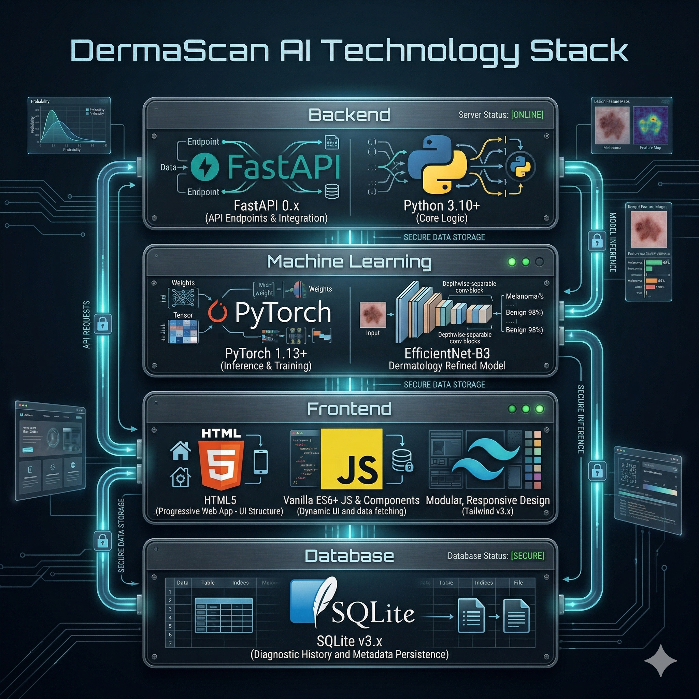
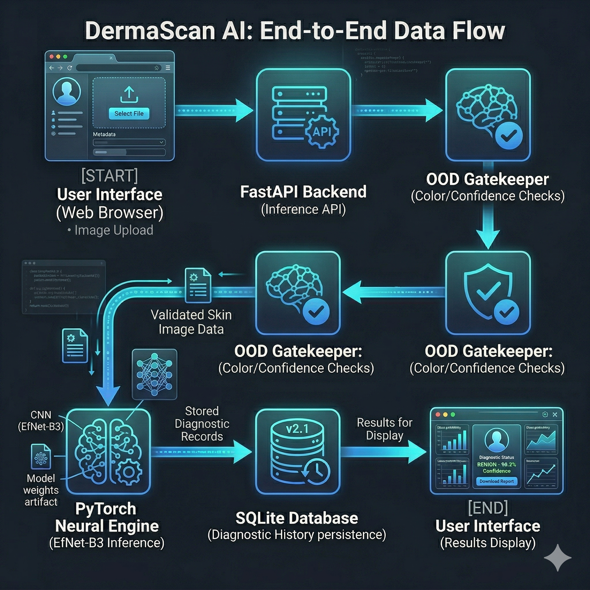

# DermaScan AI — Full Project Architecture

This document provides a comprehensive overview of the DermaScan AI project, detailing the tech stack, system architecture, and integration between components.

*Figure 2.1: Primary technologies utilized in the DermaScan AI architecture.*

## 🛠️ Technology Stack

### Backend (Python Core)
- **Framework:** [FastAPI](https://fastapi.tiangolo.com/) — Modern, high-performance web framework for building APIs.
- **Server:** [Uvicorn](https://www.uvicorn.org/) — ASGI server for production deployment.
- **Database:** [SQLite](https://www.sqlite.org/) — Lightweight, file-based relational database (`data/pathology.db`).
- **ORM:** [SQLAlchemy](https://www.sqlalchemy.org/) — Data persistence and relational mapping.

### Machine Learning (The "Brain")
- **Framework:** [PyTorch](https://pytorch.org/) — Core deep learning engine.
- **Model Library:** [TIMM (PyTorch Image Models)](https://github.com/huggingface/pytorch-image-models) — Provides the EfficientNet-B3 architecture.
- **Image Processing:** [PIL (Pillow)](https://python-pillow.org/) & [NumPy](https://numpy.org/) for loading and OOD color analysis.
- **Vision Transforms:** [Torchvision](https://pytorch.org/vision/stable/index.html) for resizing, cropping, and normalization.

### Frontend (User Interface)
- **Architecture:** Single Page Application (SPA).
- **Core:** Vanilla JavaScript (ES6) — Lightweight interactivity without heavy framework overhead.
- **Styling:** [Tailwind CSS](https://tailwindcss.com/) — Utility-first styling for a premium, responsive UI.
- **Iconography:** [Material Symbols](https://fonts.google.com/icons) — Modern clinical-style icons.
- **Theming:** Custom "Clinical Obsidian" dark mode with glassmorphism and animated scan effects.

---

## 🏗️ System Architecture

### 1. Unified Directory Structure
The project is organized into modular components to ensure portability:
- `backend/`: API routes, database models, and ML inference class.
- `frontend/`: Static assets (`index.html` and `js/app.js`).
- `models/`: Weights (`latest.pt`) and serialized thresholds.
- `data/`: Relational data (`pathology.db`) and uploaded clinical images.
- `tests/`: Automated scripts for validating model reliability.

### 2. The Data Pipeline
The system follows a sequential data flow from user interaction to persistent storage:

*Figure 2.2: End-to-End Data Flow from UI through the Backend and ML layers.*

1.  **Ingestion:** User uploads a dermoscopic image through the dashboard.
2.  **OOD Inspection:** The `ml_engine.py` runs an HSV-based color check to reject non-skin images (e.g., clothes, medical background).
3.  **Inference:** Valid skin images are passed to the EfficientNet-B3 model.
4.  **Thresholding:** Raw logits are passed through a Sigmoid layer and compared against **optimized thresholds** for the 7 classes.
5.  **Persistence:** The diagnosis, confidence, and timestamp are saved to the SQLite `History` table.
6.  **Response:** The structured JSON response is rendered by the frontend dashboard.

---

## 🔌 API & Integration

### Main Endpoints
- `POST /api/analyze`: Primary endpoint for multiclass inference and OOD gating.
- `GET /api/history`: Retrieves the archive of previous diagnostic sessions.
- `DELETE /api/history/all`: Per-request or bulk deletion of clinical history.
- `GET /api/health`: Monitors engine status and model version.

### Communication
The frontend communicates via the native `fetch` API, sending `FormData` for image uploads and receiving structured JSON for results.

---

## 🏃 Operation & Deployment
The project is designed for local clinical execution. The unified entry point is `start.py`, which initializes the database, validates model weights, and launches the Uvicorn server on port `8088`.

*Related Documentation:*
- [Model Details & Performance](./MODEL_DETAILS.md)
- [Main README](../README.md)
